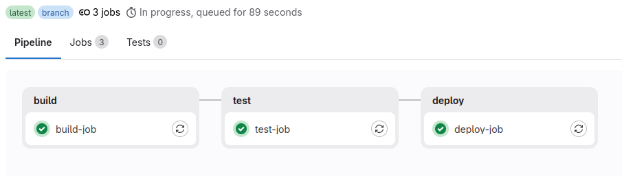
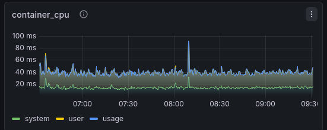

# 🐍 Django Backend: Enterprise-Ready CI/CD & Observability

Кейс по созданию масштабируемой инфраструктуры для Django-приложения. Проект демонстрирует переход от ручного управления к методологии **Infrastructure as Code (IaC)** и **Platform Engineering**.

## 🛠 Технологический стек
*   **Backend:** Python 3.11, Django, Gunicorn.
*   **Infrastructure:** Docker, Docker Compose, Ansible.
*   **CI/CD:** GitLab CI (архитектура на базе Templates, Includes и Extends).
*   **Observability:** Prometheus + cAdvisor + Grafana + Loki + Promtail.

## 🚀 Ключевые инженерные решения

### 🏗 Масштабируемая CI/CD Архитектура
Реализован подход, позволяющий DevOps-инженеру управлять пайплайнами:
*   **Централизованные шаблоны:** Вся логика вынесена в `.gitlab-ci-template.yml`. При обновлении шаблона изменения мгновенно применяются во всех проектах, использующих `include`.
*   **Механизм исключений (Overrides):** Благодаря `extends`, разработчики могут точечно переопределять переменные или шаги скриптов в своих локальных файлах, не нарушая общую структуру пайплайна.
*   **Security & Linting:** В пайплайн интегрирована автоматическая проверка стиля кода (flake8).

### 📜 Автоматизация деплоя (Ansible)
Деплой полностью декларативен и исключает необходимость настройки сервера:
*   **Оркестрация:** Ansible-плейбук управляет жизненным циклом контейнеров через современный модуль `community.docker.docker_compose_v2`.
*   **Идемпотентность:** Гарантированное целевое состояние системы при каждом запуске.
*   **Конфигурация:** Автоматическая раскатка настроек мониторинга и логирования на удаленные узлы.

    

### 📊 Наблюдаемость (Observability) & Логирование
Реализован Full-stack мониторинг для быстрого поиска причин сбоев:
*   **Metrics (Prometheus + cAdvisor):** Визуализация нагрузки (CPU в millicores, RAM) в реальном времени.
*   **Centralized Logging (Loki + Promtail):** Сбор логов Gunicorn и Django-приложения. Логи доступны в интерфейсе Grafana (Explore), что избавляет от необходимости использовать `ssh` и `docker logs`.
*   **Корреляция данных:** Возможность на одном дашборде сопоставить всплеск нагрузки на графике с конкретными строками ошибок в логах.

    

### 💾 Оптимизация под Low-Resource окружение
Система стабильно работает на VPS с **1GB RAM**:
*   Настроен Swap-файл (1GB).
*   Установлены жесткие `mem_limit` для всех контейнеров.
*   Настроена ротация логов (10MB) и Retention policy (7 дней) для экономии дискового пространства.

## 📋 Структура пайплайна
1.  **Build:** Сборка Docker-образа с использованием кэша хоста.
2.  **Test:** Unit-тесты и статический анализ кода.
3.  **Deploy:** Автоматизированная раскатка стека через Ansible.
4.  **Monitor:** Доступ к метрикам и логам через Grafana (Port 3000).

## 🚀 Основные фичи архитектуры

### Безопасность (Hardening)
*   **Non-root User**: Контейнер бэкенда запускается от имени `appuser` (UID 1000). Это предотвращает возможность получения root-прав на хосте в случае компрометации приложения.
*   **Изоляция портов**: Порт приложения (8001) работает только во внутренней сети. Доступ осуществляется строго через Nginx как Reverse Proxy.

### Конфигурация для Production
Для перехода из режима разработки в режим сервера было реализовано:
*   **Безопасный DEBUG**: В `settings.py` обеспечен строгий контроль за тем, чтобы на VPS приложение всегда запускалось с `DEBUG = False`.
*   **Настройка ALLOWED_HOSTS**: Список разрешенных доменов ограничен IP-адресом сервера и доменным именем для защиты от атак типа HTTP Host Header.

### Инфраструктура и Хранение
*   **SQLite Persistence**: Использование Docker Volumes для выноса БД на хост (`/home/ubuntu/sqlite_data`). Данные полностью изолированы от жизненного цикла контейнера.
*   **Shared Volumes для статики**: Реализована механика сбора статики (`collectstatic`) из недр контейнера в общую папку на хосте, откуда её забирает Nginx для максимально быстрой раздачи.
*   **Nginx Reverse Proxy**: Контейнер Nginx отвечает за терминацию трафика, защиту и отдачу статических файлов.

---
*Проект подготовлен как демонстрация построения надежных и масштабируемых систем мониторинга и автоматизации.*
